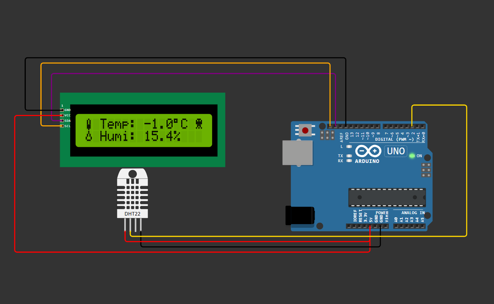

# 🌡️ DHT11 Temperature & Humidity Display with I2C LCD

This Arduino project reads **temperature** and **humidity** data from a **DHT11 sensor** and displays it on a **16x2 I2C LCD** with cool **custom emojis** (thermometer, drop, smiley, and skull). The project also includes basic **error handling** and **comfort range indication**.

---

## 🧠 Features

* 📟 Live temperature and humidity readings on LCD
* 🌡️ Custom emoji icons (Thermometer, Drop, Smiley, Skull)
* 😀 Displays a smiley when conditions are comfortable
* 💀 Displays a skull when temperature or humidity is out of range
* ⚠️ Shows “Sensor Error” message if the DHT sensor fails to read

---

## 🧰 Components Required

| Component                  | Quantity | Description                     |
| -------------------------- | -------- | ------------------------------- |
| Arduino Uno                | 1        | Main microcontroller            |
| DHT11 Sensor               | 1        | Measures temperature & humidity |
| 16x2 LCD with I2C Backpack | 1        | Displays readings               |
| Jumper Wires               | —        | For connections                 |

---
## Circuit diagram




## 🔌 Circuit Connections

| DHT11 Pin | Arduino Pin |
| --------- | ----------- |
| VCC       | 5V          |
| GND       | GND         |
| DATA      | D2          |

| LCD Pin | Arduino Pin |
| ------- | ----------- |
| SDA     | SDA          |
| SCL     | SCL         |


---

## ⚙️ Libraries Used

Install the following libraries via Arduino IDE Library Manager:

* **DHT sensor library** by Adafruit
* **Adafruit Unified Sensor**
* **LiquidCrystal_I2C**

---

## 💾 Code Overview

* The program initializes the LCD and DHT sensor.
* Custom characters (byte arrays) are defined for emojis.
* Temperature and humidity readings are displayed every second.
* Comfort range check:

  * 😀 Smiley = Temperature 20–30°C and Humidity 30–70%
  * 💀 Skull = Out of comfort range

---

## 📸 Sample LCD Output

```
🌡️ Temp: 28.3°C 😀
💧 Humi: 55.4%
---

## 🧑‍💻 Author

**Lenka Ganesh (Ecempire7)**
📷 [Instagram: @Ecempire7](https://instagram.com/ecempire7)
📺 [YouTube: Ecempire7](https://youtube.com/@Ecempire7)


LIKE THIS IS ENGOUGH FOR NEXT TIME ONWARDS
